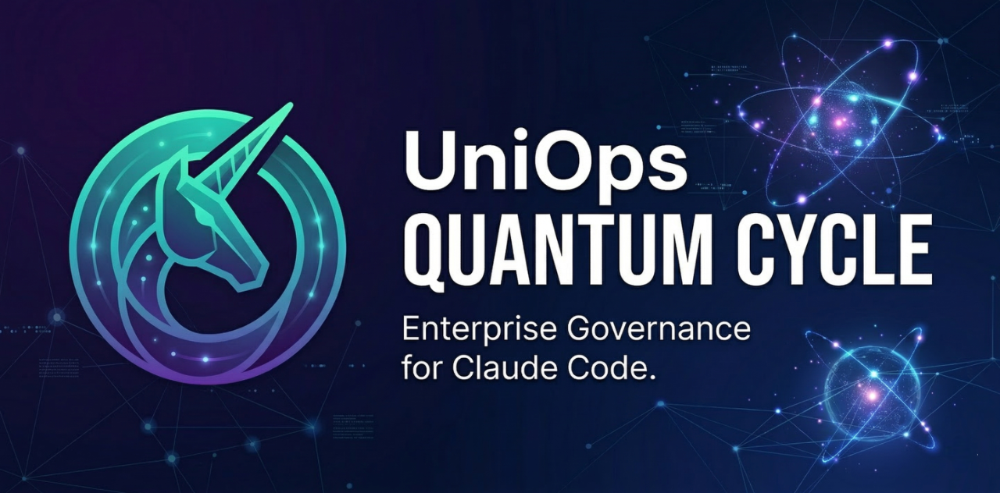
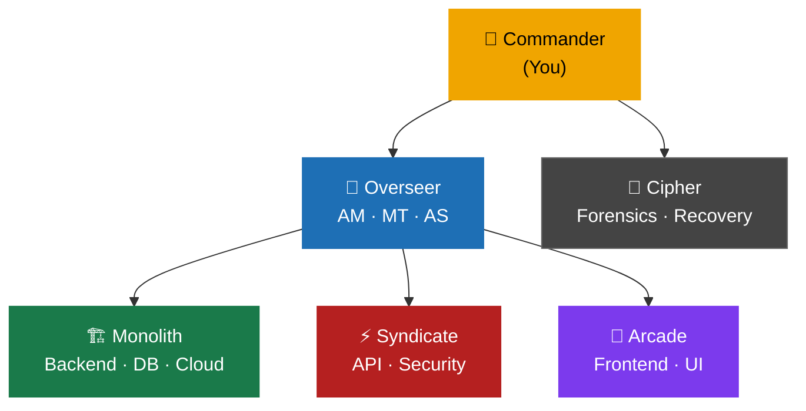
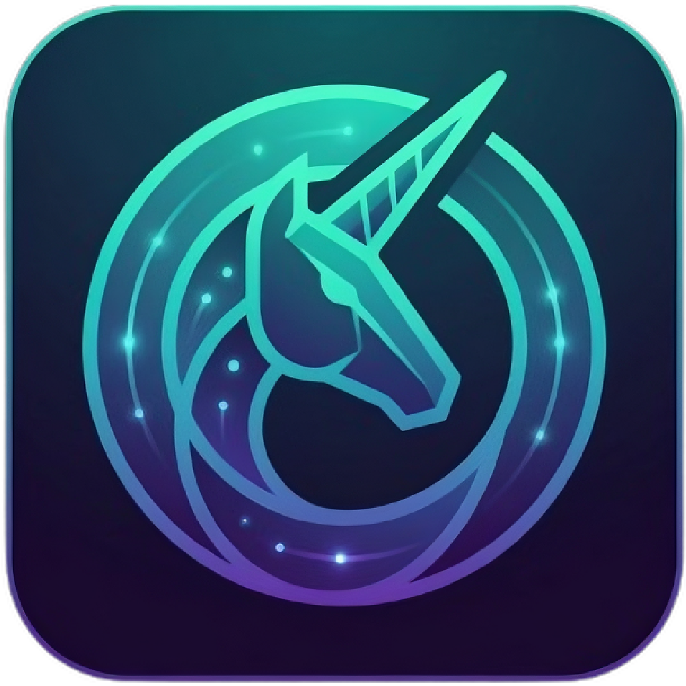

<p align="center">
  
</p>

<p align="center">
  <a href="https://github.com/VarakornUnicornTech/UniOpsQC/releases"></a>
  
  
  
  
  
  
</p>

<p align="center">
  <strong>ภาษาไทย / Thai:</strong> <a href="README.th.md">อ่าน README ภาษาไทย</a>
</p>

---

> [!NOTE]
> **Governance for Claude Code — ship with confidence, not just speed.**
> A structured multi-team AI governance framework that turns Claude Code into a coordinated engineering organization with specialized teams, approval gates, automated policy enforcement, and full audit trail.

**By [Unicorn Tech Integration Co., Ltd.](https://www.unicorntechint.com)**

---

## Table of Contents

- [Why UniOps Quantum Cycle?](#-why-uniops-quantum-cycle)
- [Quick Start](#-quick-start)
- [Three Ways to Use](#-three-ways-to-use-uniops-quantum-cycle)
- [Teams](#-teams)
- [Skills](#-skills)
- [Rules & Hooks](#-rules-path-scoped)
- [Project Structure](#-project-structure)
- [Policies](#-policy-reference)
- [Customization](#-customization)
- [Requirements](#-requirements)

---

## 🤔 Why UniOps Quantum Cycle?

<table>
<tr>
  <td align="center" width="20%">🏗️<br><b>5 Teams</b><br><sub>16 specialized personas</sub></td>
  <td align="center" width="20%">📋<br><b>Phase Gates</b><br><sub>Ticket-driven workflow</sub></td>
  <td align="center" width="20%">🔍<br><b>Full Audit Trail</b><br><sub>Every decision logged</sub></td>
  <td align="center" width="20%">⚡<br><b>21 Skills</b><br><sub>Ready-made slash commands</sub></td>
  <td align="center" width="20%">🛡️<br><b>Policy Engine</b><br><sub>9 enforced standards</sub></td>
</tr>
</table>

| | Vanilla Claude Code | **UniOps Quantum Cycle** |
|---|---|---|
| **Structure** | Single assistant | ✅ 5 teams + 16 personas |
| **Planning** | 🔧 Ad hoc | ✅ Phase dispatch + ticket gates |
| **Code Review** | 🔧 Manual | ✅ 2-pass + cross-layer trace |
| **Shipping** | 🔧 Manual git | ✅ `/git pr` with rebase + governance gates |
| **QA** | 🔧 Manual | ✅ Playwright MCP + smoke test gates |
| **Retrospective** | ❌ None | ✅ `/git lookback` — git + session data + decision audit |
| **Governance** | ❌ None | ✅ Full hierarchy + approval gates |
| **Audit Trail** | ❌ None | ✅ Every decision logged + traceable |
| **Multi-Team** | ❌ No | ✅ 4 teams + parallel execution |
| **Setup** | — | ⚡ ~30 seconds |

---

## 🚀 Quick Start

### Install via Claude Code (Recommended)

Copy and paste into Claude Code:

**🇬🇧 English:**
```
Install UniOps Quantum Cycle from https://github.com/VarakornUnicornTech/UniOpsQC into my current project. Follow the Getting Started guide at https://github.com/VarakornUnicornTech/UniOpsQC/wiki/Getting-Started
```

**🇹🇭 Thai / ภาษาไทย:**
```
ติดตั้ง UniOps Quantum Cycle จาก https://github.com/VarakornUnicornTech/UniOpsQC ลงใน project ปัจจุบัน ตาม Getting Started ที่ https://github.com/VarakornUnicornTech/UniOpsQC/wiki/Getting-Started
```

> [!TIP]
> Use **"install"** — not "read" or "explain". Saying "install" makes Claude go straight to setup without reading every policy file first.

### Manual Install

**Bash / Git Bash / macOS / Linux:**
```bash
git clone https://github.com/VarakornUnicornTech/UniOpsQC.git .claude-template
cp -r .claude-template/.claude/ your-project/.claude/
cp .claude-template/plugin.json your-project/plugin.json
cp .claude-template/.mcp.json your-project/.mcp.json
cp -r .claude-template/hooks/ your-project/hooks/
rm -rf .claude-template
```

**PowerShell (Windows):**
```powershell
git clone https://github.com/VarakornUnicornTech/UniOpsQC.git .claude-template
Copy-Item -Recurse .claude-template\.claude\ your-project\.claude\
Copy-Item .claude-template\plugin.json your-project\plugin.json
Copy-Item .claude-template\.mcp.json your-project\.mcp.json
Copy-Item -Recurse .claude-template\hooks\ your-project\hooks\
Remove-Item -Recurse -Force .claude-template
```

> [!TIP]
> After cloning, edit `.claude/ProjectEnvironment.md` with your project name and paths before starting Claude Code for the first time.

---

## 🎯 Three Ways to Use UniOps Quantum Cycle

> [!TIP]
> Each level is fully opt-in. Start at Level 1 and expand as your project grows.

<table>
<tr>
  <td align="center" width="33%">
    <h3>🚀 Level 1</h3>
    <b>"I just want better shipping"</b><br><br>
    <sub>Drop in <code>/git commit</code> and <code>/git pr</code>.<br>
    No governance overhead — just better, safer shipping.</sub>
  </td>
  <td align="center" width="33%">
    <h3>🏗️ Level 2</h3>
    <b>"I want project structure"</b><br><br>
    <sub>Use <code>/team-start</code>, <code>/phase-status</code>, <code>/bug-report</code>.<br>
    Phase-based development without full team simulation.</sub>
  </td>
  <td align="center" width="33%">
    <h3>🏛️ Level 3</h3>
    <b>"I want full governance"</b><br><br>
    <sub>Enable all hooks, activate agent teams, full session logging.<br>
    Enterprise-grade traceability out of the box.</sub>
  </td>
</tr>
</table>

---

## 👥 Teams



| Team | Domain | Style |
|------|--------|-------|
| **Overseer** | Project management, architecture decisions | Balanced, cautious, standards-compliant |
| **Monolith** | Core backend, infrastructure, DB schema, cloud, docs | Verbose, type-safe, bulletproof |
| **Syndicate** | API integration, query optimization, security | Pragmatic, terse, performance-focused |
| **Arcade** | Frontend UI, gamification, creative systems | Clever, modern, innovative |
| **Cipher** | Hardware diagnostics, disk forensics, RAID recovery | Surgical, zero-write, verify-before-acting |

---

## ⚡ Skills

| Category | Command | Purpose |
|----------|---------|---------|
| 🔄 **Workflow** | `/team-start [Team] [Project] [Phase] [free\|hold]` | Formal team kickoff |
| 🔄 **Workflow** | `/phase-status [Project]` | Full project phase + ticket status |
| 🔄 **Workflow** | `/compact-resume` | Post-compact re-orientation |
| 🔄 **Workflow** | `/overseer-report [ID]` | File OverseerReport entry |
| 📋 **Planning** | `/bug-report [Project] [desc]` | Create bug fix ticket + folders |
| 📋 **Planning** | `/mod-log [Project] [name]` | Create modification ticket + folders |
| 📋 **Planning** | `/sub-feature [Project] [name]` | Create sub-feature ticket + folders |
| ✅ **Quality** | `/audit [Project] [scope?]` | End-to-end multi-domain audit — finds gap bugs |
| ✅ **Quality** | `/git status` | Quick git state overview — branch, divergence, working tree |
| ✅ **Quality** | `/git commit [branch?]` | Governed commit — safety gates, 2-pass review, ticket gate |
| ✅ **Quality** | `/git pr [branch?]` | Governed PR — safety gates, review, test, push, pull request |
| ✅ **Quality** | `/git sync [remote?] [branch?]` | Governed sync — fetch upstream/origin, compare, merge/rebase |
| ✅ **Quality** | `/git lookback [period?]` | Retrospective — rebase-aware git + session data + decision audit |
| 🎭 **Persona** | `/Overseer` `/Monolith` `/Syndicate` `/Arcade` `/Cipher` | Switch active team persona |
| 🔧 **Framework** | `/template [action]` | Version check, diff, update, rollback |

---

## 📐 Rules (Path-Scoped)

Policy rules in `.claude/rules/` load automatically based on file context:

| Rule | When It Loads | Key Rules |
|------|--------------|-----------|
| `governance.md` | Always | Plan-before-code, no-code-before-ticket, ticket/briefing standards, phase gates |
| `logging.md` | Always | Session logging, rotation, handover, OverseerReport, TeamChat |
| `debugging.md` | Code files (`.ts`, `.js`, `.py`, etc.) | Instrument-first, probe standards, cross-layer trace, gap bugs |
| `testing.md` | Test files (`*.test.*`, `*.spec.*`) | Unit tests, regression gates, living docs |
| `codebase-scanning.md` | Always | L1/L2/L3 tiered scan protocol, completeness checks |
| `parallel-execution.md` | Always | ZCB guarantee, ticket ownership, multi-session |
| `skills-and-subagents.md` | Always | Skill format, orchestration modes, subagent triggers |

---

## 🪝 Hooks (Automated Enforcement)

Hooks are defined in `.claude/settings.json` under the `"hooks"` key. Scripts live in `hooks/scripts/`.

| Hook | Event | What It Does |
|------|-------|-------------|
| `SessionStart` | Session start | Confirms RoundTable governance framework is active |
| `check-ticket-exists` | PreToolUse (Edit/Write) | Warns if no ticket exists before code edits |
| `log-file-change` | PostToolUse (Edit/Write) | Logs file changes to session audit trail |
| Protected files | PreToolUse (Edit/Write) | Prompt hook — blocks edits to CLAUDE.md, policies, agents without authorization |

> [!WARNING]
> **Windows note:** Hook scripts require Git Bash or WSL. Ensure `bash` and `jq` are available in your PATH. Scripts use `#!/usr/bin/env bash` shebangs and Unix path separators.

---

## 🎭 Playwright MCP (Browser Automation)

Verification Scholars can use Playwright for UX Smoke Test Gates and User Journey Walkthroughs.
Configuration: `.mcp.json` at project root.

---

## 📁 Project Structure

```
your-project/
├── .claude/
│   ├── CLAUDE.md                # Core policy (entry point)
│   ├── ProjectEnvironment.md    # Project registry
│   ├── settings.json            # Permissions + hooks + protected file rules
│   ├── agents/                  # 5 team agent definitions
│   ├── rules/                   # 7 path-scoped rule files
│   ├── skills/                  # 21 slash command skills
│   │   ├── git/                 # Unified VCS: status, commit, pr, sync, lookback
│   │   │   └── checklists/      # Critical, informational, suppressions
│   │   ├── audit/               # Multi-domain gap bug finder
│   │   └── ...
│   ├── policies/                # 9 detailed policy files (§1–§9)
│   └── team_chat/               # Team communication logs + Cipher diagnostics
├── hooks/                       # Hook scripts (config in .claude/settings.json)
│   └── scripts/                 # check-git-workflow.sh, check-ticket-exists.sh, log-file-change.sh
├── .mcp.json                    # Playwright browser automation
├── plugin.json                  # Plugin manifest
└── RoundTable/                  # Session logs (created at runtime)
```

---

## 📋 Policy Reference

<details>
<summary>📋 View all 9 policies (§1–§9)</summary>

| Policy | What It Covers |
|--------|---------------|
| §1 Logging & RoundTable | Session logging, log format, rotation policy |
| §2 Tickets & Briefings | Phase dispatch, briefing mail, ticket standards, UX smoke test |
| §3 Team Chat & Handover | Cross-team protocol, OverseerReport, handoff files |
| §4 Development Structure | Project organization, planning-first workflow, error catalog |
| §5 Pre-Existing Codebase | Tiered scan protocol (L1/L2/L3), completeness verification |
| §6 Debugging Protocol | Instrument-first rule, probe standards, gap bug detection |
| §7 Parallel Execution | ZCB guarantee, ticket ownership, dependency signals |
| §8 Skills & Subagents | Skill catalogue, orchestration modes, subagent standards |
| §9 Multi-Session | One-session-per-project, project-prefixed logging |

</details>

---

## 🔧 Customization

<details>
<summary>🔧 How to customize UniOps Quantum Cycle for your project</summary>

UniOps Quantum Cycle is designed to be forked and customized:

- **Rename team members** — edit agent files to match your preferred code names
- **Add/remove teams** — create new agent files or remove unused ones
- **Adjust policies** — modify policy files in `policies/`
- **Add skills** — create new `.claude/skills/[name]/SKILL.md` files
- **Tune rules** — edit `.claude/rules/` files to adjust enforcement level
- **Change authority naming** — replace "Commander" with your preferred title
- **Toggle hooks** — switch from warning to blocking mode in hook scripts

</details>

---

## 📦 Requirements

- [Claude Code](https://docs.anthropic.com/en/docs/claude-code) CLI installed
- Claude API access (Anthropic API key)

## 👤 Author

**Unicorn Tech Integration Co., Ltd.**
- Website: [unicorntechint.com](https://www.unicorntechint.com)
- GitHub: [@VarakornUnicornTech](https://github.com/VarakornUnicornTech)
- Location: Bangkok, Thailand

## ⚖️ License

MIT License — see [LICENSE](LICENSE) for details.

---

<p align="center">
  
</p>
<p align="center">
  <b>UniOps Quantum Cycle v2.0.0</b><br>
  Built with ❤️ by <a href="https://www.unicorntechint.com">Unicorn Tech Integration Co., Ltd.</a>
  · Bangkok, Thailand 🇹🇭
</p>
<p align="center">
  <a href="GETTING_STARTED.md">Getting Started</a> ·
  <a href="CONTRIBUTING.md">Contributing</a> ·
  <a href="CHANGELOG.md">Changelog</a> ·
  <a href="LICENSE">License</a>
</p>
