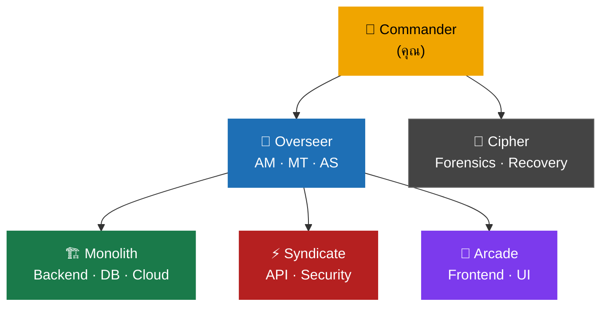

<p align="center">
  
</p>

<p align="center">
  <a href="https://github.com/VarakornUnicornTech/UniOpsQC/releases"></a>
  
  
  
  
  
  
</p>

<p align="center">
  <strong>🇬🇧 English:</strong> <a href="README.md">Read README in English</a>
</p>

---

> [!NOTE]
> **ระบบบริหารจัดการทีม AI สำหรับ Claude Code — ship ด้วยความมั่นใจ ไม่ใช่แค่ความเร็ว**
> เปลี่ยน Claude Code ให้กลายเป็นองค์กรวิศวกรรมที่ทำงานประสานกัน ด้วยทีมเฉพาะทาง approval gate นโยบายที่บังคับใช้อัตโนมัติ และ audit trail ครบถ้วน

**โดย [Unicorn Tech Integration Co., Ltd.](https://www.unicorntechint.com)**

---

## สารบัญ

- [ทำไมต้อง UniOps Quantum Cycle?](#-ทำไมต้อง-uniops-quantum-cycle)
- [เริ่มต้นใช้งาน](#-เริ่มต้นใช้งาน)
- [3 ระดับการใช้งาน](#-3-ระดับการใช้งาน)
- [ทีม](#-ทีม)
- [Skills](#-skills)
- [Rules & Hooks](#-rules-path-scoped)
- [โครงสร้างโปรเจค](#-โครงสร้างโปรเจค)
- [นโยบาย](#-นโยบาย)
- [การปรับแต่ง](#-การปรับแต่ง)
- [ความต้องการของระบบ](#-ความต้องการของระบบ)

---

## 🤔 ทำไมต้อง UniOps Quantum Cycle?

<table>
<tr>
  <td align="center" width="20%">🏗️<br><b>5 ทีม</b><br><sub>16 personas เฉพาะทาง</sub></td>
  <td align="center" width="20%">📋<br><b>Phase Gates</b><br><sub>ขั้นตอนผ่าน ticket</sub></td>
  <td align="center" width="20%">🔍<br><b>Audit Trail ครบถ้วน</b><br><sub>บันทึกทุกการตัดสินใจ</sub></td>
  <td align="center" width="20%">⚡<br><b>21 Skills</b><br><sub>Slash command พร้อมใช้</sub></td>
  <td align="center" width="20%">🛡️<br><b>Policy Engine</b><br><sub>มาตรฐาน 9 ข้อ</sub></td>
</tr>
</table>

| | Claude Code ทั่วไป | **UniOps Quantum Cycle** |
|---|---|---|
| **โครงสร้าง** | Single assistant | ✅ 5 ทีม + 16 personas |
| **การวางแผน** | 🔧 ไม่มีระบบ | ✅ Phase dispatch + ticket gates |
| **Code Review** | 🔧 ตรวจเอง | ✅ 2-pass + cross-layer trace |
| **การ Ship** | 🔧 git manual | ✅ `/git pr` พร้อม governance gates |
| **QA** | 🔧 ตรวจเอง | ✅ Playwright MCP + smoke test gates |
| **Retrospective** | ❌ ไม่มี | ✅ git + session data + decision audit |
| **Governance** | ❌ ไม่มี | ✅ ลำดับชั้นครบ + approval gates |
| **Audit Trail** | ❌ ไม่มี | ✅ บันทึกและตรวจสอบได้ทุกการตัดสินใจ |
| **Multi-Team** | ❌ ไม่ได้ | ✅ 4 ทีม + parallel execution |
| **ติดตั้ง** | — | ⚡ ~30 วินาที |

---

## 🚀 เริ่มต้นใช้งาน

### ติดตั้งผ่าน Claude Code (แนะนำ)

คัดลอก prompt ด้านล่างแล้ววางลงใน Claude Code:

**🇹🇭 ภาษาไทย:**
```
ติดตั้ง UniOps Quantum Cycle จาก https://github.com/VarakornUnicornTech/UniOpsQC ลงใน project ปัจจุบัน ตาม Getting Started ที่ https://github.com/VarakornUnicornTech/UniOpsQC/wiki/Getting-Started
```

**🇬🇧 English:**
```
Install UniOps Quantum Cycle from https://github.com/VarakornUnicornTech/UniOpsQC into my current project. Follow the Getting Started guide at https://github.com/VarakornUnicornTech/UniOpsQC/wiki/Getting-Started
```

> [!TIP]
> ใช้คำว่า **"ติดตั้ง"** หรือ **"install"** — ไม่ใช่ "อ่าน", "อธิบาย" หรือ "ศึกษา rules"
> การพูดถึง ".claude rules" ทำให้ Claude อ่านไฟล์ policy ทุกไฟล์ก่อนเริ่มติดตั้ง — ช้ากว่ามาก

### ติดตั้งด้วยตัวเอง (Manual Install)

**Bash / Git Bash / macOS / Linux:**
```bash
git clone https://github.com/VarakornUnicornTech/UniOpsQC.git .claude-template
cp -r .claude-template/.claude/ your-project/.claude/
cp .claude-template/plugin.json your-project/plugin.json
cp .claude-template/.mcp.json your-project/.mcp.json
cp -r .claude-template/hooks/ your-project/hooks/
rm -rf .claude-template
```

**PowerShell (Windows):**
```powershell
git clone https://github.com/VarakornUnicornTech/UniOpsQC.git .claude-template
Copy-Item -Recurse .claude-template\.claude\ your-project\.claude\
Copy-Item .claude-template\plugin.json your-project\plugin.json
Copy-Item .claude-template\.mcp.json your-project\.mcp.json
Copy-Item -Recurse .claude-template\hooks\ your-project\hooks\
Remove-Item -Recurse -Force .claude-template
```

> [!TIP]
> หลังจาก clone แล้ว แก้ไข `.claude/ProjectEnvironment.md` ด้วยชื่อโปรเจคและ path ก่อนเปิด Claude Code เป็นครั้งแรก

---

## 🎯 3 ระดับการใช้งาน

> [!TIP]
> แต่ละระดับเป็น opt-in ทั้งหมด เริ่มจาก Level 1 แล้วขยายตามความต้องการ

<table>
<tr>
  <td align="center" width="33%">
    <h3>🚀 Level 1</h3>
    <b>"แค่อยากให้ ship ได้ดีขึ้น"</b><br><br>
    <sub>ใช้ <code>/git commit</code> และ <code>/git pr</code><br>
    ไม่มี governance overhead — แค่ ship ได้ดีขึ้น</sub>
  </td>
  <td align="center" width="33%">
    <h3>🏗️ Level 2</h3>
    <b>"อยากมีโครงสร้างโปรเจค"</b><br><br>
    <sub>ใช้ <code>/team-start</code>, <code>/phase-status</code>, <code>/bug-report</code><br>
    พัฒนาแบบ phase-based โดยไม่ต้องจำลองทีมเต็มรูปแบบ</sub>
  </td>
  <td align="center" width="33%">
    <h3>🏛️ Level 3</h3>
    <b>"อยากได้ governance เต็มรูปแบบ"</b><br><br>
    <sub>เปิด hooks ทั้งหมด ใช้ agent teams บันทึกครบถ้วน<br>
    ระดับ enterprise ออกจากกล่อง</sub>
  </td>
</tr>
</table>

---

## 👥 ทีม



| ทีม | ขอบเขต | สไตล์ |
|-----|--------|-------|
| **Overseer** | บริหารโปรเจค, ตัดสินใจด้านสถาปัตยกรรม | สมดุล, รอบคอบ, ปฏิบัติตามมาตรฐาน |
| **Monolith** | Backend หลัก, Infrastructure, DB schema, Cloud, เอกสาร | Verbose, type-safe, bulletproof |
| **Syndicate** | API integration, Query optimization, Security | Pragmatic, กระชับ, มุ่งประสิทธิภาพ |
| **Arcade** | Frontend UI, Gamification, ระบบสร้างสรรค์ | ชาญฉลาด, ทันสมัย, สร้างสรรค์ |
| **Cipher** | วินิจฉัยฮาร์ดแวร์, Disk forensics, กู้คืน RAID | ผ่าตัดแม่นยำ, zero-write, ตรวจสอบก่อนลงมือ |

---

## ⚡ Skills

| Category | Command | ความสามารถ |
|----------|---------|-----------|
| 🔄 **Workflow** | `/team-start [Team] [Project] [Phase] [free\|hold]` | เริ่มต้นทีมอย่างเป็นทางการ |
| 🔄 **Workflow** | `/phase-status [Project]` | รายงาน phase + สถานะ ticket ทั้งหมด |
| 🔄 **Workflow** | `/compact-resume` | กลับเข้า session หลัง compact |
| 🔄 **Workflow** | `/overseer-report [ID]` | บันทึก OverseerReport |
| 📋 **Planning** | `/bug-report [Project] [desc]` | สร้าง bug fix ticket + โฟลเดอร์ |
| 📋 **Planning** | `/mod-log [Project] [name]` | สร้าง modification ticket + โฟลเดอร์ |
| 📋 **Planning** | `/sub-feature [Project] [name]` | สร้าง sub-feature ticket + โฟลเดอร์ |
| ✅ **Quality** | `/audit [Project] [scope?]` | Audit แบบ end-to-end — หา gap bugs |
| ✅ **Quality** | `/git status` | Quick git state overview — branch, divergence, working tree |
| ✅ **Quality** | `/git commit [branch?]` | Governed commit — safety gates, 2-pass review, ticket gate |
| ✅ **Quality** | `/git pr [branch?]` | Governed PR — safety gates, review, test, push, pull request |
| ✅ **Quality** | `/git sync [remote?] [branch?]` | Governed sync — fetch upstream/origin, compare, merge/rebase |
| ✅ **Quality** | `/git lookback [period?]` | Retrospective — git + session data + decision audit |
| 🎭 **Persona** | `/Overseer` `/Monolith` `/Syndicate` `/Arcade` `/Cipher` | สลับ persona ของทีม |
| 🔧 **Framework** | `/template [action]` | Version check, diff, update, rollback |

---

## 📐 Rules (Path-Scoped)

ไฟล์ rule ใน `.claude/rules/` โหลดอัตโนมัติตาม context ของไฟล์:

| Rule | เมื่อโหลด | บังคับใช้ |
|------|----------|----------|
| `governance.md` | ทุกไฟล์ | Plan-before-code, no-code-before-ticket, ticket/briefing standards, phase gates |
| `logging.md` | ทุกไฟล์ | Session logging, rotation, handover, OverseerReport, TeamChat |
| `debugging.md` | Code files (`.ts`, `.js`, `.py` ฯลฯ) | Instrument-first, probe standards, cross-layer trace |
| `testing.md` | Test files (`*.test.*`, `*.spec.*`) | Unit tests, regression gates, living docs |
| `codebase-scanning.md` | ทุกไฟล์ | L1/L2/L3 tiered scan protocol, completeness checks |
| `parallel-execution.md` | ทุกไฟล์ | ZCB guarantee, ticket ownership, multi-session |
| `skills-and-subagents.md` | ทุกไฟล์ | Skill format, orchestration modes, subagent triggers |

## 🪝 Hooks (Automated Enforcement)

Hooks กำหนดใน `.claude/settings.json` ภายใต้ key `"hooks"` Scripts อยู่ใน `hooks/scripts/`

| Hook | Event | ทำอะไร |
|------|-------|--------|
| `SessionStart` | เริ่ม session | ยืนยันว่า RoundTable governance framework ทำงานอยู่ |
| `check-ticket-exists` | PreToolUse (Edit/Write) | เตือนถ้าไม่มี ticket ก่อนแก้ไขโค้ด |
| `log-file-change` | PostToolUse (Edit/Write) | บันทึกการเปลี่ยนแปลงไฟล์ลง audit trail |
| Protected files | PreToolUse (Edit/Write) | Prompt hook — บล็อกการแก้ไข CLAUDE.md, policies, agents โดยไม่ได้รับอนุญาต |

> [!WARNING]
> **Windows:** Hook scripts ต้องใช้ Git Bash หรือ WSL ตรวจสอบให้แน่ใจว่า `bash` และ `jq` อยู่ใน PATH Scripts ใช้ shebangs `#!/usr/bin/env bash` และ Unix path separators

---

## 🎭 Playwright MCP (Browser Automation)

Verification Scholars ใช้ Playwright สำหรับ UX Smoke Test Gates และ User Journey Walkthroughs
Configuration: `.mcp.json` ที่ root ของโปรเจค

---

## 📁 โครงสร้างโปรเจค

```
your-project/
├── .claude/
│   ├── CLAUDE.md                # นโยบายหลัก (จุดเริ่มต้น)
│   ├── ProjectEnvironment.md    # ทะเบียนโปรเจค
│   ├── settings.json            # Permissions + hooks + protected file rules
│   ├── agents/                  # นิยามทีม 5 ทีม
│   ├── rules/                   # 7 ไฟล์กฎตามเส้นทาง
│   ├── skills/                  # Slash command 21 รายการ
│   │   ├── git/                 # VCS รวม: status, commit, pr, sync, lookback
│   │   │   └── checklists/      # Critical, informational, suppressions
│   │   ├── audit/               # Multi-domain gap bug finder
│   │   └── ...
│   ├── policies/                # ไฟล์นโยบาย 9 ฉบับ (§1–§9)
│   └── team_chat/               # บันทึกการสื่อสารระหว่างทีม + Cipher
├── hooks/                       # Hook scripts (config ใน .claude/settings.json)
│   └── scripts/                 # check-git-workflow.sh, check-ticket-exists.sh, log-file-change.sh
├── .mcp.json                    # Playwright browser automation
├── plugin.json                  # Plugin manifest
└── RoundTable/                  # Session logs (สร้างตอน runtime)
```

---

## 📋 นโยบาย

<details>
<summary>📋 ดูนโยบายทั้ง 9 ข้อ (§1–§9)</summary>

| นโยบาย | ครอบคลุมเรื่อง |
|--------|--------------|
| §1 Logging & RoundTable | การบันทึก session, รูปแบบ log, นโยบายหมุนเวียนไฟล์ |
| §2 Tickets & Briefings | การ dispatch phase, briefing mail, มาตรฐาน ticket, UX smoke test |
| §3 Team Chat & Handover | โปรโตคอลข้ามทีม, OverseerReport, ไฟล์ส่งต่องาน |
| §4 Development Structure | การจัดระเบียบโปรเจค, planning-first workflow, error catalog |
| §5 Pre-Existing Codebase | Tiered Scan Protocol (L1/L2/L3), การตรวจสอบความสมบูรณ์ |
| §6 Debugging Protocol | กฎ Instrument-First, มาตรฐาน probe, สแกนผลกระทบข้างเคียง |
| §7 Parallel Execution | ZCB guarantee, ความเป็นเจ้าของ ticket, สัญญาณ dependency |
| §8 Skills & Subagents | รายการ skill, โหมดการ orchestrate, มาตรฐาน subagent |
| §9 Multi-Session | One-session-per-project, project-prefixed logging |

</details>

---

## 🔧 การปรับแต่ง

<details>
<summary>🔧 วิธีปรับแต่ง UniOps Quantum Cycle สำหรับโปรเจคของคุณ</summary>

UniOps Quantum Cycle ออกแบบมาให้ fork และปรับแต่งได้:

- **เปลี่ยนชื่อสมาชิกทีม** — แก้ไขไฟล์ agent ให้ตรงกับชื่อรหัสที่คุณต้องการ
- **เพิ่ม/ลบทีม** — สร้างไฟล์ agent ใหม่หรือลบที่ไม่ใช้
- **ปรับนโยบาย** — แก้ไขไฟล์นโยบายใน `policies/` ให้เหมาะกับโปรเจค
- **เพิ่ม skill** — สร้างไฟล์ `.claude/skills/[name]/SKILL.md` ใหม่
- **ปรับระดับ enforcement** — แก้ไขไฟล์ใน `.claude/rules/`
- **เปลี่ยนชื่อผู้มีอำนาจ** — แทนที่ "Commander" ด้วยตำแหน่งที่คุณต้องการ
- **Toggle hooks** — สลับระหว่าง warning กับ blocking mode ใน hook scripts

</details>

---

## 📦 ความต้องการของระบบ

- ติดตั้ง [Claude Code](https://docs.anthropic.com/en/docs/claude-code) CLI
- มี Claude API access (Anthropic API key)

## 👤 ผู้พัฒนา

**Unicorn Tech Integration Co., Ltd.**
- เว็บไซต์: [unicorntechint.com](https://www.unicorntechint.com)
- GitHub: [@VarakornUnicornTech](https://github.com/VarakornUnicornTech)
- สถานที่: กรุงเทพมหานคร, ประเทศไทย

## ⚖️ สัญญาอนุญาต

MIT License — ดูรายละเอียดที่ [LICENSE](LICENSE)

---

<p align="center">
  
</p>
<p align="center">
  <b>UniOps Quantum Cycle v2.0.0</b><br>
  สร้างด้วย ❤️ โดย <a href="https://www.unicorntechint.com">Unicorn Tech Integration Co., Ltd.</a>
  · กรุงเทพมหานคร, ประเทศไทย 🇹🇭
</p>
<p align="center">
  <a href="GETTING_STARTED.md">Getting Started</a> ·
  <a href="CONTRIBUTING.md">Contributing</a> ·
  <a href="CHANGELOG.md">Changelog</a> ·
  <a href="LICENSE">License</a>
</p>
